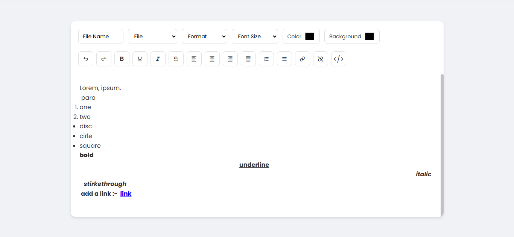

# Building a Rich Text Editor (HTML, CSS & JavaScript)



This is a small, self-contained Rich Text Editor demo built with plain HTML, CSS and JavaScript. It demonstrates how to use a `contenteditable` element together with browser text-editing commands to provide a simple word-processor-like experience in the browser.

Below you'll find what the project contains, how it works, how to run it, and ideas for improvements.

## Project structure

- `index.html` — The editor UI and toolbar. Loads `style.css`, `script.js`, and the `html2pdf` library for PDF export.
- `style.css` — Styling and layout for the toolbar and editable area.
- `script.js` — The editor logic: toolbar command handlers, file actions (save as text / PDF), link handling, and a "show code" toggle.
- `images/` — Project images (contains `showPreview.png` used for quick preview in documentation).
- `Readme.md` — This file.

## Live demo / How to run

Because this is a static HTML project you have two quick options to try it out:

- Open `index.html` directly in your browser (double-click the file or open with the browser).
- Or serve the directory with a simple local server (recommended for some browsers/extensions). In PowerShell (Windows) you can run:

```powershell
python -m http.server 8000
# then open http://localhost:8000 in your browser
```

Or using npx (if you have Node.js):

```powershell
npx http-server . -p 8000
# then open http://localhost:8000 in your browser
```

## Features

- Basic text formatting using the browser's editing commands (bold, italic, underline, strikethrough).
- Paragraph and heading formats (via the Format select).
- Text alignment (left, center, right, justify).
- Ordered and unordered lists.
- Font size selection (uses `document.execCommand('fontSize', ...)`).
- Text color and highlight (foreground and background color pickers).
- Undo / Redo (via browser commands).
- Create / remove links (prompt for URL when creating).
- Save as plain-text (.txt) using a Blob and download.
- Export to PDF using the included `html2pdf.js` library.
- "Show code" toggle: switch the editable content to show the underlying HTML source (read-only when viewing source).

## How it works (implementation details)

At the core of this editor is an element with `contenteditable="true"` (`#content`). The toolbar buttons call `formatDoc()` which delegates to `document.execCommand(...)` to apply formatting. Main functions are:

- `formatDoc(cmd, value)` — wrapper around `document.execCommand`. If `value` is provided it passes it along (used for commands like `createLink`, `foreColor`, `hiliteColor`, `fontSize`, etc.).
- `addLink()` — prompts the user for a URL and calls `formatDoc('createLink', url)`.
- `fileHandle(value)` — handles the `File` select actions:
	- `new` — clears the editor and sets filename to `untitled`.
	- `txt` — extracts `content.innerText`, creates a `Blob`, and triggers a download as `.txt`.
	- `pdf` — calls `html2pdf(content).save(fileName)` to create and download a PDF.
- Show code toggle — toggles between editable HTML and a plain text view of the HTML source. When active the editor becomes non-editable and shows `textContent` (the HTML source). When toggled off it sets `innerHTML` back and restores `contenteditable`.

There is a small UX nicety: anchors (`<a>`) inside the editor are wired so that when you hover them the editor disables `contenteditable` and sets links to open in a new tab (`target="_blank"`). This prevents clicking a link from editing the content.

Notes on APIs used

- `document.execCommand()` — simple and widely supported, but marked as deprecated in some specs. It still works in current evergreen browsers, but for production-ready editors you should consider using modern Selection / Range APIs and sanitizing HTML before saving or exporting.
- `html2pdf.js` — used for PDF export.

## Files explained

- `index.html` — builds the toolbar and the editable area. Contains selects for File (New / Save .txt / Save PDF), Format (heading/paragraph), Font Size, color inputs for text and background, and a set of buttons for common commands.
- `script.js` — all editor behavior. Clean and small, easy to extend. Key functions are `formatDoc`, `addLink`, `fileHandle`, and the show-code toggle. It also handles making links open in a new tab on hover.
- `style.css` — lightweight layout and styling. The editor area has a fixed height with a custom scrollbar and responsive toolbar controls.

## Browser support & limitations

- Works in modern browsers (Chrome, Edge, Firefox, Safari). Some features (PDF generation and `execCommand` behavior) may vary slightly between browsers.
- Because `document.execCommand()` is considered legacy/deprecated by some specs, behavior can be inconsistent for complex use-cases. This project is a learning/demo app, not a production-ready editor.

## Accessibility & security notes

- ContentEditable can expose users to XSS if you accept or store HTML from untrusted sources. Always sanitize saved HTML on the server before rendering in a real app.
- Keyboard navigation for the toolbar is limited; consider adding ARIA attributes and keyboard shortcuts for accessibility improvements.

## Suggestions & next steps (ideas to improve the editor)

- Replace `execCommand` with a custom implementation using Selection/Range APIs for better control and future-proofing.
- Add paste handling that sanitizes and normalizes pasted HTML.
- Add image insertion and drag-and-drop uploads (store images as base64 or upload to a server).
- Add local auto-save (localStorage) and open/save project files (JSON with HTML and metadata).
- Provide richer font-family selection, and more granular font-size control using CSS instead of `fontSize` execCommand.
- Add a toolbar state sync: when caret moves, show which formatting is active (bold, italic, current font size, etc.).

## Contributing

This is a small demo. If you'd like to contribute improvements, open an issue or send a PR with focused changes (e.g., switching to a modern editing engine, accessibility fixes, or added features). Keep changes small and include a short description of how you tested them.

## Try it

1. Open `index.html` in your browser.
2. Use the toolbar to format text, create links, change colors, and export as TXT or PDF.
3. Toggle the `</>` button to view the HTML source of the editor content.

## License

You can treat this project as MIT-style demo code for learning and experimentation.

---

If you'd like, I can also:

- Add a short GIF or screenshot to this `Readme.md` using `images/showPreview.png`.
- Add keyboard shortcuts and ARIA attributes to the toolbar for accessibility.
- Replace `execCommand` with a Selection/Range-based implementation (larger task).

Tell me which of the above you'd like next and I'll implement it.

